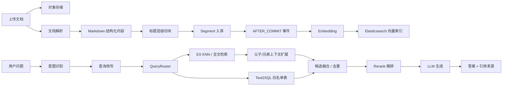

# 基于 RAG 的智能面试平台

一个以 **RAG 知识库问答与智能面试出题** 为核心的面试训练系统。

项目围绕“把技术文档、简历、JD 和面试过程沉淀成可检索、可追问、可评估的知识上下文”展开：后端负责文档解析、结构化切块、向量化、检索增强、Rerank、引用溯源和面试 Agent；前端提供知识库管理、RAG 对话、简历分析、模拟面试和模型配置等页面。

语音面试模块保留为交互扩展能力，主线能力是 **RAG 知识库构建、检索增强生成和基于知识库的自适应面试**。

## 项目定位

本项目适合作为 RAG / AI 应用方向的工程实践项目，重点体现以下能力：

- 从 PDF、Word、Markdown、TXT 等非结构化文档构建面试知识库。
- 使用 Markdown 标题层级进行语义切块，并维护父子、兄弟 chunk 关系。
- 基于 Elasticsearch 做原生 KNN 向量检索和带过滤全文检索，支持多知识库 metadata 过滤。
- 内置 RAG 检索评测接口，计算 Hit@K、MRR、NDCG 并保存评测 run。
- 通过 Query Rewrite、RetrievalAugmentor 编排、Rerank 和上下文扩展提升回答质量。
- 支持 Text2SQL 查询白名单业务表，把简历、面试记录、日程和评分统计纳入多源 RAG。
- 在流式问答中返回检索进度、引用来源和置信度信息。
- 将 RAG 能力落到面试场景：知识库检索、简历读取、Skill 出题、追问和评估。

## 核心功能

### RAG 知识库

- 文档上传：支持单文件和批量上传，文件存储到 S3 兼容对象存储。
- 文档解析：Markdown 直接处理，PDF/Word 等文件通过 MinerU 解析，失败时可降级到 Tika。
- 结构化切块：按 Markdown 标题层级切分，保留 `chunkId`、`parentChunkId`、`brotherChunkId`、兄弟序号等元数据。
- 异步向量化：切块事务提交后发布 `DocumentChunkedEvent`，通过 `@Async + AFTER_COMMIT` 触发向量写入。
- 向量存储：使用 LangChain4j `ElasticsearchEmbeddingStore`，以 metadata 区分用户、知识库和版本。
- 版本管理：支持上传新版本、激活/失效版本、版本切换、重新向量化和旧向量清理。
- 补偿任务：定时扫描停留在 `CHUNKED` 状态的版本，自动重试向量化。

### RAG 问答

- 多知识库问答：一次提问可关联多个知识库。
- 流式输出：SSE 返回回答 token，并推送“理解问题、检索、排序、生成”等阶段进度。
- 查询改写：结合历史对话改写用户问题，增强检索命中率。
- 检索模式：默认走原生 ES KNN 向量检索，支持 `vector`、`full_text`、`hybrid` 三种模式；本地 Basic 许可证不依赖 ES RRF。
- 候选融合：自定义内容聚合器兼容 LangChain4j 多检索源结果，并在进入 Rerank 前做去重和排名融合。
- Rerank 精排：默认使用 DashScope `gte-rerank-v2` 云端精排；显式配置 `provider=local` 时才启用本地 ONNX BGE Reranker。
- small-to-big 上下文扩展：命中小 chunk 后优先保留命中片段，再补充邻近兄弟 chunk 和父级章节，减少上下文碎片化。
- 引用溯源：回答末尾返回来源片段，非流式接口会返回 sources、confidence 和无效引用编号。
- 检索 Trace：保存原问题、改写问题、路由策略、命中 chunk、rerank 后顺序、最终引用和答案。
- 多源路由：QueryRouter 可将问题路由到知识库 ES、Text2SQL 或二者混合，结构化 SQL 结果跳过 Rerank 并置顶。
- RAG 评测：`/api/knowledgebase/evaluate-retrieval` 复用知识库检索链路，计算 Hit@K、MRR、NDCG，结果保存到 `rag_evaluation_runs`。
- 意图识别：非面试、非技术、非求职类问题可走通用对话兜底，避免强行检索造成幻觉。
- 会话管理：支持创建 RAG 会话、历史消息、置顶、重命名和关联知识库调整。

### 表格与结构化数据

- CSV/TSV 解析：保留表头、Markdown 表格和按行展开的键值记录。
- Excel 解析：使用 Apache POI 读取 `.xls/.xlsx` 的 sheet、行和单元格，失败时降级 Tika 文本解析。
- Text2SQL：仅暴露 `resumes`、`resume_analyses`、`interview_sessions`、`interview_answers`、`interview_schedule` 白名单表。
- 安全边界：Text2SQL 由 LangChain4j 做 SELECT 校验，本项目额外注入当前 `user_id` 约束，并用只读 DataSource 强制连接只读。生产环境仍建议为 Text2SQL 配置数据库只读账号。

### 智能面试

- Skill 出题：内置 Java 后端、前端、算法、系统设计、AI Agent、阿里/字节/腾讯专项等方向。
- JD 解析：根据岗位描述匹配面试 Skill 和考察范围。
- ReAct Agent 出题：基于 LangChain4j AiServices，模型可调用知识库检索工具和简历读取工具后生成下一题。
- 文字模拟面试：支持创建会话、获取当前问题、提交/修改回答、结束会话。
- 异步评估：通过 Redis Stream 触发面试评估任务，统一生成评分、反馈、优势和改进建议。
- PDF 导出：支持导出面试报告和简历分析报告。

### 简历与日程

- 简历上传和解析：支持 PDF、Word、TXT，解析后异步生成 AI 分析。
- 简历库：查看历史简历、分析状态、详情和导出报告。
- 面试安排：维护公司、岗位、轮次、时间、会议链接和状态。
- 邀约解析：规则解析常见邀约文本，规则失败后可调用 LLM 补充解析。

### 系统能力

- 用户认证：注册、登录、刷新 token，使用 JWT 做接口鉴权。
- 多模型配置：支持 DashScope、Kimi、DeepSeek、GLM、LM Studio 等 OpenAI 兼容 Provider。
- 默认模型切换：可配置默认 ChatModel 和 EmbeddingModel。
- 接口限流：基于 `@RateLimit` 和 Redis Lua 脚本实现多维度限流。
- 分布式锁：知识库上传、切块、版本切换等写操作使用 Redisson 锁防并发冲突。
- 指标监控：暴露 Actuator、Prometheus 指标，覆盖 RAG 流式延迟、结构化输出、异步队列等。

## RAG 主链路



## 技术栈

### 后端

| 类型 | 技术 |
| --- | --- |
| 基础框架 | Spring Boot 3.5.6、Java 21、虚拟线程 |
| AI 编排 | LangChain4j 1.11.0、AiServices、RetrievalAugmentor |
| 模型接入 | OpenAI 兼容接口、DashScope、Kimi、DeepSeek、GLM、LM Studio |
| 向量检索 | Elasticsearch 8.17、LangChain4j ElasticsearchEmbeddingStore |
| 关系数据库 | PostgreSQL 16、Spring Data JPA、Flyway |
| 缓存与异步 | Redis、Redisson、Redis Stream |
| 文档解析 | MinerU、Apache Tika、Apache POI |
| 文件存储 | S3 兼容对象存储，开发依赖可用 RustFS，完整容器环境使用 MinIO |
| 精排 | DashScope `gte-rerank-v2`，可选本地 ONNX BGE Reranker |
| 导出 | iText 8 |
| 监控 | Spring Boot Actuator、Micrometer、Prometheus |

### 前端

| 类型 | 技术 |
| --- | --- |
| 基础框架 | React 18、TypeScript、Vite |
| 样式 | Tailwind CSS 4 |
| 路由 | React Router |
| 动效与图表 | Framer Motion、Recharts |
| Markdown 展示 | react-markdown、remark-gfm、react-syntax-highlighter |
| 大列表 | react-virtuoso |
| 日历 | React Big Calendar |

## 目录结构

```text
ai-interview
├── backend
│   ├── src/main/java/com/linrun/interview
│   │   ├── common                  # 通用基础能力：鉴权、限流、锁、AI Provider、异步模板
│   │   ├── infrastructure          # 文件、Redis、PDF、MapStruct 等基础设施
│   │   └── modules
│   │       ├── knowledgebase        # RAG 知识库、版本、切块、检索、会话问答
│   │       ├── interview            # 模拟面试、Skill、Agent、异步评估
│   │       ├── resume               # 简历上传、解析、AI 分析
│   │       ├── interviewschedule    # 面试日程和邀约解析
│   │       ├── llmprovider          # 多模型配置和默认模型切换
│   │       ├── user                 # 注册、登录、JWT
│   │       └── voiceinterview       # 语音面试扩展
│   └── src/main/resources
│       ├── db/migration             # Flyway 迁移
│       ├── prompts                  # RAG、面试、简历分析提示词
│       └── skills                   # 面试方向 Skill 定义
├── frontend
│   └── src
│       ├── api                      # 后端 API 封装
│       ├── components               # 通用组件和业务组件
│       └── pages                    # 知识库、RAG 对话、简历、面试、设置页面
├── docker                          # 数据库初始化脚本
├── docker-compose.dev.yml           # 本地开发依赖服务
└── docker-compose.yml               # 完整容器化部署参考
```

## 快速开始

### 环境要求

- JDK 21
- Maven 3.9+
- Node.js 20+
- pnpm 10+
- Docker / Docker Compose
- DashScope API Key，至少用于默认 LLM 和 Embedding

### 1. 配置环境变量

复制示例配置：

```bash
cp .env.example .env
```

至少填写：

```properties
AI_BAILIAN_API_KEY=your_dashscope_api_key_here
AI_MODEL=qwen3.5-flash
```

如果只跑 RAG 主链路，语音相关配置可以先不管。

### 2. 启动本地依赖

推荐开发方式是只用 Docker 启动基础设施，后端和前端在本机运行：

```bash
docker compose -f docker-compose.dev.yml up -d
```

该文件会启动：

- PostgreSQL：`localhost:5432`
- Redis：`localhost:6379`
- Elasticsearch：`localhost:9200`
- RustFS：API `localhost:9100`，控制台 `localhost:9101`

首次使用 RustFS 时，需要在控制台手动创建 `interview-guide` bucket。账号密码使用 `.env` 中的 `APP_STORAGE_ACCESS_KEY` / `APP_STORAGE_SECRET_KEY`，示例配置默认为 `minioadmin` / `minioadmin`。

### 3. 启动后端

```bash
mvn -pl backend -am spring-boot:run
```

后端默认端口为：

```text
http://localhost:8082
```

Swagger UI：

```text
http://localhost:8082/swagger-ui.html
```

### 4. 启动前端

```bash
cd frontend
pnpm install
pnpm dev
```

前端开发端口在 `frontend/vite.config.ts` 中配置为：

```text
http://localhost:5174
```

Vite 已将 `/api` 代理到 `http://localhost:8082`。

### 5. 完整容器化启动

如果不想分别启动前后端，可以直接使用完整 Compose：

```bash
docker compose up -d --build
```

默认宿主机端口：

```text
前端：http://localhost:28080
后端：http://localhost:28082
PostgreSQL：localhost:25432
Redis：localhost:26379
Elasticsearch：http://localhost:29200
MinIO：http://localhost:29001
```

## Rerank 模型说明

RAG 默认使用 DashScope 云端 `gte-rerank-v2` 精排：

```properties
APP_AI_RAG_RERANK_PROVIDER=cloud
```

如果你希望使用本地精排，再显式切换：

```properties
APP_AI_RAG_RERANK_PROVIDER=local
```

本地模型文件较大，不进入 Git。请按该目录下的 README 下载：

```text
backend/src/main/resources/model/bge-reranker-model/
model_quantized.onnx
tokenizer.json
```

或者关闭精排：

```properties
APP_AI_RAG_RERANK_ENABLED=false
```

## 常用接口

| 模块 | 接口 |
| --- | --- |
| 认证 | `POST /api/auth/register`、`POST /api/auth/login` |
| 知识库 | `POST /api/knowledgebase/upload`、`GET /api/knowledgebase/list` |
| 批量上传 | `POST /api/knowledgebase/upload/batch` |
| RAG 问答 | `POST /api/knowledgebase/query`、`POST /api/knowledgebase/query/stream` |
| RAG 检索评测 | `POST /api/knowledgebase/evaluate-retrieval` |
| RAG Trace | `GET /api/knowledgebase/traces`、`GET /api/knowledgebase/traces/{traceId}` |
| 表格数据预览 | `GET /api/knowledgebase/{id}/data/preview` |
| RAG 会话 | `POST /api/rag-chat/sessions`、`POST /api/rag-chat/sessions/{id}/messages/stream` |
| 知识库版本 | `GET /api/knowledgebase/{id}/versions`、`POST /api/knowledgebase/{id}/versions/{versionId}/switch` |
| 简历 | `POST /api/resumes/upload`、`GET /api/resumes` |
| 面试 | `POST /api/interview/sessions`、`GET /api/interview/sessions/{sessionId}/question` |
| Agent 出题 | `POST /api/interview/agent/next-question` |
| Skill | `GET /api/interview/skills`、`POST /api/interview/skills/parse-jd` |
| 模型配置 | `GET /api/llm-provider/list`、`PUT /api/llm-provider/default-provider` |

## 配置重点

常用配置都在 `backend/src/main/resources/application.yml` 中，支持通过 `.env` 覆盖：

| 配置 | 说明 |
| --- | --- |
| `app.ai.default-provider` | 默认聊天模型 Provider |
| `app.ai.default-embedding-provider` | 默认 Embedding Provider |
| `elasticsearch.host` | Elasticsearch 地址 |
| `elasticsearch.index-name` | 向量索引名称 |
| `elasticsearch.num-candidates` | ES hybrid/KNN 候选数量 |
| `app.ai.rag.rewrite.enabled` | 是否启用查询改写 |
| `app.ai.rag.search.*` | 召回数量和最低分阈值 |
| `app.ai.rag.hybrid.enabled` | 是否允许混合检索链路 |
| `app.ai.rag.hybrid.mode` | `hybrid` / `vector` / `full_text`，默认 `vector` |
| `app.ai.rag.sql.enabled` | 是否启用 Text2SQL |
| `app.ai.rag.sql.router-enabled` | 是否启用 LLM 多源 QueryRouter |
| `app.ai.rag.rerank.enabled` | 是否启用 Rerank |
| `app.ai.rag.rerank.provider` | `cloud` / `local`，默认 `cloud` |
| `app.ai.rag.parent-expand.enabled` | 是否启用父子/兄弟上下文扩展 |
| `app.ai.rag.intent-recognition.enabled` | 是否启用 RAG 意图识别 |
| `app.storage.*` | S3 兼容对象存储配置 |
| `app.security.jwt.*` | JWT 配置 |

## 面试时可以重点讲的技术点

1. 文档处理不是简单按长度切块，而是先解析为 Markdown，再按标题层级构建 parent/brother chunk 关系。
2. 知识库向量化通过事务后事件异步触发，失败时状态停留在 `CHUNKED`，由定时补偿任务兜底。
3. 检索不是裸向量召回，而是 ES KNN/全文检索、查询改写、候选融合、Rerank 精排和 small-to-big 上下文扩展组合。
4. 项目提供 RAG 检索评测接口，可用 Hit@K、MRR、NDCG 量化召回效果，并保存评测 run。
5. 多源 RAG 支持 ES 知识库和 Text2SQL，QueryRouter 可按问题类型路由到结构化数据、非结构化知识库或混合检索。
6. Text2SQL 做了白名单 schema、当前用户隔离、SELECT 校验和只读连接，能讲清楚安全边界。
7. CSV/Excel 表格会被转换成 Markdown 表格和行记录，适合导入题库、JD、面试记录等半结构化资料。
8. RAG 流式问答不仅返回 token，还返回检索阶段进度和引用来源，前端可以展示更透明的生成过程。
9. 知识库支持版本切换和向量清理，避免不同版本文档的向量污染。
10. 面试 Agent 把 RAG 检索工具和简历读取工具封装为 LangChain4j `@Tool`，由模型自主决定何时调用。
11. 多模型 Provider 做成运行时配置，可切换默认模型、Embedding 模型，并缓存模型实例。

## 测试与构建

后端测试：

```bash
mvn -pl backend test
```

本次 RAG 核心链路的轻量验证：

```bash
mvn -pl backend "-Dtest=InterviewQueryRouterTest,ReadOnlyDataSourceTest,InterviewHybridContentAggregatorTest,SpreadsheetProcessServiceTest,RagEvaluationServiceTest" test
```

前端构建：

```bash
cd frontend
pnpm build
```

后端打包：

```bash
mvn -pl backend -am package -DskipTests
```

## 备注

- 完整容器化部署可参考 `docker-compose.yml`，但日常开发更推荐 `docker-compose.dev.yml + 本机后端 + 本机前端`。
- 语音面试依赖 ASR/TTS 和浏览器麦克风权限，属于扩展交互能力；如果只展示 RAG 项目，可以不作为主讲内容。
- 本地 Elasticsearch Basic 许可证不支持 ES RRF，默认 `vector` 模式会绕开该限制；如需 `hybrid`，请确认许可证和索引 mapping 兼容。
- Text2SQL 应使用生产只读数据库账号；应用层只读连接是额外保护，不替代数据库权限。
- `V1__baseline.sql` 中保留了早期演进痕迹，当前运行态以代码、后续 Flyway 迁移和 `application.yml` 中的 Elasticsearch RAG 配置为准。
