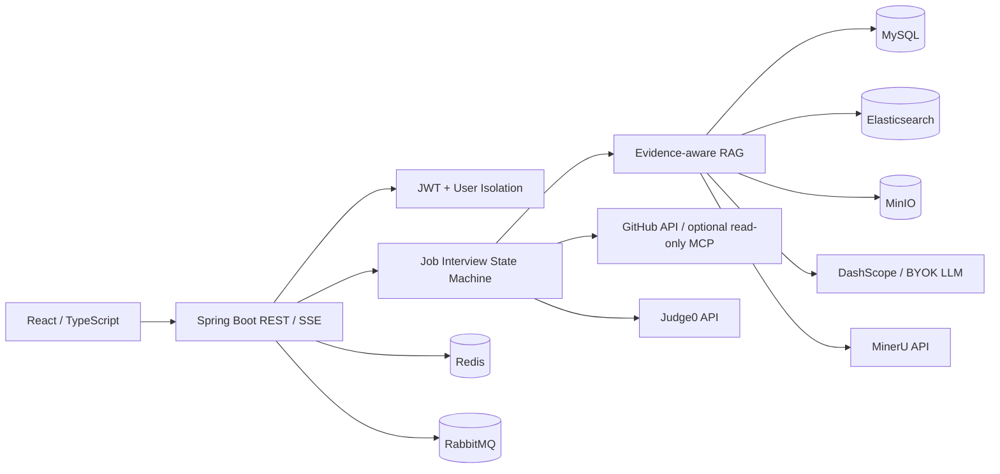

# AI Interview

面向求职者的 AI 面试平台。项目以 RAG 为技术主线，将目标岗位 JD、候选人资料、GitHub
公开仓库代码和平台审核知识组织为有边界、可追溯的面试证据，完成岗位考核、算法作答和复盘训练闭环。
它不是招聘 CRM，也不是“上传一个知识库后随机提问”的演示项目。

当前 V1 已完成代码、本地自动化门禁与关键浏览器流程回归，包含能力模板、四域证据 RAG、
GitHub 固定 SHA 取证、四阶段岗位实战、Hot 100 算法、证据报告、能力画像和专项训练。
GitHub REST 公共仓库同步和 Judge0 正常判题链路已有真实本地联调证据；MinerU 官方解析、可选
GitHub MCP 实际命中、Judge0 异常与补判路径、完整 45 分钟面试，以及 4C6G 服务器 24 小时观察
仍属于发布验收边界，不能把本地结果描述成线上结果。

## 项目边界

- 产品主叙事是“围绕目标岗位完成真实考核闭环”，招聘雷达和求职资源只负责把用户引导到岗位实战。
- RAG 负责文档处理、切块、分域检索、RRF、Rerank、上下文扩展、引用、Trace 和离线评测。
- 面试工作流由 Java 显式状态机持有事实状态；Planner / Interviewer / Critic 组合
  Plan-and-Execute 与受限 Reflection，不引入 LangGraph4j 作为第二状态源。
- BYOK 路由用户触发的生成请求；Embedding、云 Rerank 和系统任务使用平台配置。
- 目标部署为 4C6G、5 人以内。MinerU、LLM 和 Judge0 使用外部 API，应用服务器不部署大模型，
  也不运行不可信候选人代码。

## V1 核心闭环

### 1. 目标岗位与能力模板

- 持久化 JD，完成结构化分析、原文证据映射、能力确认和版本冻结。
- 版本化内容目录提供 Java 后端与 AI 应用 / RAG / Agent 两套岗位模板、13 个能力原子、题型和 Rubric。
- 已发布内容按 checksum 幂等导入；普通用户不能执行内容导入或读取其他用户的 JD。

### 2. 四域证据化 RAG

```text
MinIO 私有对象
  -> MinerU 官方异步 API / Tika 明确降级
  -> Markdown 结构化切块
  -> 事务提交后向量化 + 补偿任务
  -> PLATFORM / JOB / CANDIDATE / GITHUB 硬过滤
  -> Elasticsearch BM25 + Vector + RRF
  -> Rerank + 父子/兄弟上下文扩展
  -> EvidencePacket / EvidenceRef / RagQueryTrace
```

- `EvidenceScope` 显式绑定用户、数据域、资源和版本，避免把所有资料混进无边界知识库。
- 面试准备可以使用 Query Decomposition 与 CRAG；实时面试走较轻的检索路径并保留明确降级。
- HyDE 保留用于离线 RAG 评测，生产默认关闭；CRAG 也不进入每次实时追问。
- 文档版本、分段状态、乐观锁与补偿任务用于收敛 MySQL / Elasticsearch 最终一致性。
- CSV / Excel 按普通文档转为 Markdown 后检索，不让 LLM 动态生成 SQL。

### 3. GitHub 项目深挖

- 仅支持用户主动绑定的 `github.com` 公开仓库，固定 Commit SHA 后选择性同步源码、测试、配置和 CI。
- 文件白名单、大小预算、敏感文件检测和代码感知切块共同约束进入 GITHUB 域的内容。
- 面试问题可以引用 SHA、路径、符号和行号；仓库正文始终作为不可信数据进入模型。
- 固定 SHA 同步主通道是 GitHub REST API；平台 Token 只用于提高公开只读 API 的限流额度，
  不接收候选人的 Token。
- GitHub 只读 MCP 是默认关闭的可选复核通道；只有 owner / repo / SHA / path 白名单校验通过，
  且返回正文哈希与固定快照一致时才采用，否则回退快照。平台不会向外暴露通用 MCP Server。

### 4. 岗位实战与算法

- 岗位准备通过 RabbitMQ 异步生成冻结计划和证据快照；JD 与模板是硬依赖，简历、资料和 GitHub 可选。
- 实战按项目深挖、岗位技术、算法、工程场景四阶段推进，REST 指令具有幂等键和乐观版本控制，
  SSE 只负责推送，MySQL 才是事实源。
- 会话支持暂停和 24 小时内一次续面；恢复机会用尽后仍可提前交卷或中止。指令执行使用 5 分钟
  数据库租约，请求侧与分钟级任务都会回收进程宕机留下的执行槽。
- 题库保存 Hot 100 映射，V1 启用 20 道平台重述题；Java 和 Python 3 参考实现均经过真实解释器 / 编译器测试。
- Monaco Editor 本地打包并按路由懒加载。Judge0 提供客观执行事实；不可用时只标记待补判，
  LLM 不能冒充代码执行器。
- 本地已通过 Judge0 CE 公开实例验证 Java 正常提交、轮询、用例结果及耗时 / 内存落库；公开实例
  不作为可用性承诺，限流、超时和恢复后补判仍需在目标部署环境验收。

### 5. 证据化复盘

- 报告异步汇总题目、回答、代码执行和证据引用，最多给出三个可追溯能力缺口；生成任务使用
  10 分钟数据库租约和分钟级补偿，claim 后进程宕机或消息丢失不会永久停在生成中。
- 能力画像按最近三次有效证据确定性聚合为待验证、薄弱、稳定、优势或待复核，不输出 Offer 概率。
- 专项训练记录提示、重做和答案使用情况；带提示练习不能直接把能力提升为稳定或优势。
- 用户可以查看自己的模型、调用耗时、输入 / 输出 Token、重试与降级，不回显 API Key 或完整 Prompt。

### 6. 安全、可靠性与可观测性

- JWT 登录、数据用户隔离、BYOK Key AES-GCM 加密、Prompt Injection 防御和外部连接器白名单。
- 简历分析、文字面试评估、岗位准备和报告任务使用 RabbitMQ；消费端检查实体、幂等状态和重试元数据。
- 文档向量化使用事务提交后的 Spring 事件与补偿任务，不与业务 MQ 混用。
- `TraceContext` + MDC 关联 HTTP 请求，`RagQueryTrace` 和 Agent Trace 保留业务可追溯性。
- Actuator / Micrometer 导出 Prometheus 指标，Grafana 展示单机资源和 RAG / Agent 指标；日志策略禁止
  写入密钥、完整 Prompt、简历、资料正文、候选人回答、源码和隐藏用例。

## 架构



详细调用链、状态机、API、数据表和降级规则见：

- [`docs/ARCHITECTURE.md`](docs/ARCHITECTURE.md)
- [`docs/API_DATA_REFERENCE.md`](docs/API_DATA_REFERENCE.md)
- [`docs/FAILURE_MATRIX.md`](docs/FAILURE_MATRIX.md)

## 技术栈

| 层 | 技术 |
| --- | --- |
| 后端 | Java 21、Spring Boot、Spring Security、MyBatis-Plus、LangChain4j |
| 前端 | React 18、TypeScript、Vite、Tailwind CSS 4、Lucide、Framer Motion、Monaco Editor |
| 数据 | MySQL 8、Redis、Elasticsearch、MinIO |
| 异步 | RabbitMQ、Spring after-commit event + compensation job |
| AI / RAG | DashScope / OpenAI-compatible BYOK、MinerU API、BM25 + Vector + RRF、Rerank、CRAG |
| 外部取证 / 判题 | GitHub REST API、可选 GitHub read-only MCP Client、Judge0 API |
| 观测 | Micrometer、Prometheus、Grafana、可选轻量 ELK、业务 Trace |
| 工程 | Maven、pnpm、Docker Compose、Caddy、JUnit 5、Mockito、AssertJ、Vitest |

## 目录

```text
ai-interview/
├── backend/          # Spring Boot 后端
├── frontend/         # React 前端
├── docs/             # 受版本控制的架构、API/数据和故障边界
├── eval/             # RAG 检索/生成评测与负载脚本
├── dev-ops/          # 开发依赖、生产 Compose、Prometheus/Grafana/可选日志栈
└── study/            # 代码接管与面试答辩记录
```

## 开发启动

环境：JDK 21、Maven 3.9+、Node.js 20+、pnpm、Docker Desktop / Docker Engine。

1. 从模板创建本地配置，只在 `.env` 写真实密钥。

```powershell
$ErrorActionPreference = 'Stop'
Copy-Item .env.example .env
```

2. 启动依赖。

```powershell
$ErrorActionPreference = 'Stop'
docker compose -f dev-ops/docker-compose-environment.yml up -d
```

3. 在终端 A 启动后端。

```powershell
$ErrorActionPreference = 'Stop'
mvn -pl backend spring-boot:run
```

4. 在终端 B 安装依赖并启动前端。

```powershell
$ErrorActionPreference = 'Stop'
pnpm -C frontend install
pnpm -C frontend dev
```

前端默认 `http://localhost:5174`，后端默认 `http://localhost:8082`，Swagger 为
`http://localhost:8082/swagger-ui.html`。密钥说明见 [`SETUP_API_KEYS.md`](SETUP_API_KEYS.md)。

## 本地验证证据

2026-07-16 在当前工作树执行了以下门禁：

- 后端：根目录 `mvn test` 共 424 tests，0 failures，0 errors，3 skipped；跳过项是需要真实
  Redis 环境的集成测试。
- 前端：Vitest 共 16 个测试文件、33 tests 全部通过；TypeScript 检查和生产构建通过，
  Monaco 作为独立懒加载 chunk。
- Compose：全部声明拓扑与端口 / 健康检查 / 资源上限策略通过配置校验；核心常驻预算
  3136 MiB，叠加 Prometheus、Grafana、Logstash、Kibana 后为 4608 MiB。
- Fresh schema：临时 MySQL 8 空库初始化通过，共 51 张表、54 个外键。
- 本地生产拓扑：使用隔离项目名和空卷启动 7 个核心容器，全部 healthy 且零重启；注册、登录、
  鉴权、能力模板、算法降级和 JD CRUD 冒烟通过。

同一轮本地浏览器与真实外部依赖验收还确认了：

- 登录后可访问工作台、岗位实战、专项训练、历史面试、招聘雷达、求职资源、知识库、日程、
  RAG 评测和设置等主要页面，未发现应用级控制台错误。
- RAG 会话可按知识库检索并返回引用，刷新后可恢复会话与消息；岗位选择卡片不会再被普通项目问题误触发。
- GitHub REST 将公开仓库固定到 Commit SHA 后同步成功：验收样例为 120 个文件、442 个代码证据片段，
  且片段均完成向量索引；这不等于 GitHub MCP 已真实命中。
- Judge0 CE 验收样例的 Java 提交通过全部用例，并保存 provider submission id、耗时和内存；
  这只证明正常路径，不代表公开服务的 SLA。

复现本地自动化门禁：

```powershell
$ErrorActionPreference = 'Stop'
mvn -pl backend -am clean test
pnpm -C frontend test -- --run
pnpm -C frontend exec tsc --noEmit
pnpm -C frontend build
./dev-ops/ci/Test-ReleaseContent.ps1
./dev-ops/ci/Test-ComposeConfig.ps1
./dev-ops/ci/Test-PowerShellSyntax.ps1
./dev-ops/ci/Test-DeploymentAssets.ps1
./dev-ops/ci/Test-FreshSchema.ps1
```

这些结果证明当前代码、内容、构建、关键本地浏览器流程，以及 GitHub REST / Judge0 正常路径；
不代表 MinerU 官方解析、GitHub MCP 实际命中、Judge0 异常与补判、整场 45 分钟面试、线上容量、
恢复演练或 4C6G 24 小时稳定性。

## 部署

本地全栈、生产 Compose、Caddy HTTPS、环境变量、健康检查和故障处理见：

- [`dev-ops/README.md`](dev-ops/README.md)
- [`dev-ops/DEPLOY.md`](dev-ops/DEPLOY.md)
- [`dev-ops/.env.prod.example`](dev-ops/.env.prod.example)

没有目标服务器、应用与 files 域名，以及 MinerU / GitHub MCP 等剩余外部服务验收时，仓库可以完成
本地构建、关键流程和 Compose 门禁，但不能宣称已经完整上线。

## 已删除的范围

为了保持 RAG 主线和 4C6G 部署边界，以下能力已从生产代码、依赖、配置、SQL、前端和 Compose 中移除：

- Neo4j / Text2Cypher 知识图谱
- Text2SQL 和动态业务表查询
- 语音面试、WebSocket、ASR / TTS
- 平台向外暴露的 MCP Server
- Langfuse 自托管栈
- RocketMQ 双引擎
- “Agent Skill”包装、Persona 与未审核 Markdown references

GitHub 只读 MCP Client 是面试中的受限外部取证通道，不属于已删除的平台 MCP Server。保留历史旧 URL
的前端跳转只用于避免老链接空白，不表示相关后端能力仍存在。

## 开源与数据边界

- 题库只保存 Hot 100 映射和平台自行重述的题面，不复制力扣原题、题解或隐藏用例。
- GitHub 只读固定 SHA，不读私库、不使用候选人 PAT、不执行写操作。
- 候选人简历、JD、资料、回答和源码都是用户数据，不进入 PLATFORM 公共知识域。
