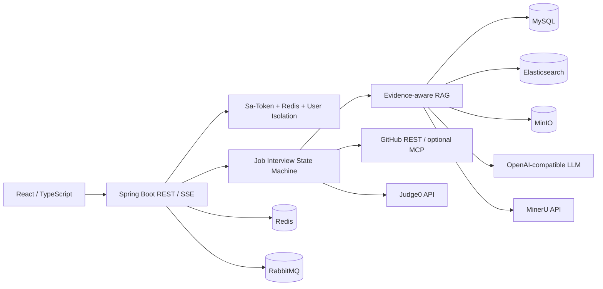

# AI 面试平台 (AI Interview)

## 项目简介

AI 面试平台是一套面向技术面试场景的全栈应用，覆盖知识库问答、岗位实战、专项训练与效果评测。
系统以证据化 RAG 与显式状态机 Multi-Agent 编排为主线，把文档处理、意图识别、混合检索、
引用校验、面试出题与评估、报告复盘串成可演示、可回归的闭环。

本服务提供知识库管理、意图门控问答、岗位实战、算法判题、GitHub 固定快照取证、统一评测等能力，
支持单机 4C6G 量级部署，适合作为本地开发与小规模演示环境。

## 系统架构

### 架构特点

- **前后端分离**：React 前端 + Spring Boot REST / SSE
- **证据化 RAG**：MinIO 私有对象、结构化切块、Elasticsearch 混合检索与可追溯引用
- **显式状态机编排**：Planner / Interviewer / Critic，有界 Reflexion，不引入第二状态源
- **异步可靠**：RabbitMQ 承载长任务；文档向量化走提交后事件与补偿
- **数据隔离**：Sa-Token + Redis 会话与按用户隔离；用户触发的生成请求走自带模型配置
- **可观测**：业务 Trace、Micrometer / Prometheus / Grafana

### 核心链路

```text
资料上传
  -> MinerU 官方解析 / Tika 降级
  -> Markdown 切块与向量化
  -> 意图门（相关则检索，越域则闲聊）
  -> BM25 + Vector + RRF + Rerank + 上下文扩展
  -> 生成与 grounded 引用校验
  -> RagQueryTrace / 评测固定集回归
```

面试侧由 Java 状态机持有会话事实；RAG 提供证据包；报告异步汇总能力缺口与专项训练入口。



## 模块结构

```text
ai-interview/
├── backend/          # Spring Boot 后端（业务、RAG、面试编排、评测接口）
├── frontend/         # React 18 + TypeScript 前端
├── eval/             # 检索 / 生成 / Critic 评测与负载脚本
├── dev-ops/          # 本地 Compose、监控与开发检查
└── study/            # 本地学习与答辩笔记（默认不纳入版本控制）
```

## 核心功能

### 1. 知识库与证据化 RAG

- **入库**：私有对象存储、官方解析与明确降级、版本与补偿
- **检索**：四域证据范围硬过滤、BM25 + 向量 + RRF、Rerank、上下文扩展
- **问答**：意图门控、SSE 进度事件、grounded 引用闸门与查询 Trace
- **评测**：意图 Macro-F1、Hit / MRR / NDCG、Judge 与基线对比

### 2. Multi-Agent 面试编排

- **状态机**：`PLANNING → ASKING → CRITIQUING` 等显式阶段
- **角色**：Planner / Interviewer / Critic 组合 Plan-and-Execute 与受限 Reflection
- **记忆**：Redis 窗口记忆与 CandidateMemory 画像
- **Trace**：前端可回放编排轨迹，便于讲清重试与降级

### 3. 岗位实战与算法

- **岗位准备**：JD 结构化、能力模板、异步生成冻结计划
- **实战会话**：项目深挖 / 岗位技术 / 算法 / 工程场景，REST 幂等与乐观版本
- **判题**：Monaco 编辑器 + Judge0 客观执行；不可用时标记待补判
- **GitHub**：公开仓固定 Commit SHA 同步，白名单与敏感文件检测

### 4. 报告与专项训练

- **报告**：异步汇总回答、代码结果与证据引用，给出可追溯能力缺口
- **画像**：按近期有效证据聚合强弱项，不输出录用概率类结论
- **训练**：提示、重做与答案使用记录，带提示练习不直接抬高画像档位

### 5. 安全与可靠性

- 登录鉴权、数据用户隔离、模型访问凭证加密存储
- Prompt Injection 防护与外部连接器白名单
- 长任务有界重试、租约与补偿，避免永久卡在处理中

## 技术栈

### 后端

| 项 | 选型 |
| --- | --- |
| 语言 / 运行时 | Java 21 |
| 框架 | Spring Boot 3.5.x、Sa-Token + Redis |
| ORM | MyBatis-Plus 3.5.x |
| AI | LangChain4j 1.11.x |
| 数据 | MySQL 8、Redis、Elasticsearch、MinIO |
| 消息 | RabbitMQ |
| 观测 | Micrometer、Prometheus、Grafana |

### 前端与工程

| 项 | 选型 |
| --- | --- |
| 前端 | React 18、TypeScript、Vite、Tailwind CSS 4、Monaco Editor |
| 构建 | Maven 3.9+、pnpm |
| 测试 | JUnit 5、Mockito、AssertJ、Vitest |
| 部署 | Docker Compose |

## 技术亮点

### 1. 意图门 + 可观测 RAG

三路意图融合后决定是否检索；SSE 暴露改写、召回、融合、精排、扩展、生成与引用校验阶段，
回答侧用 grounded 状态约束无证据胡说。

### 2. 显式状态机 Multi-Agent

面试事实状态只在 Java 状态机中维护；Critic 打回通过有界 Reflexion 回到提问，避免自由
AgentLoop 与双状态源漂移。

### 3. 证据范围与四域隔离

PLATFORM / JOB / CANDIDATE / GITHUB 硬过滤，查询必须携带显式证据范围，避免无边界混库。

### 4. 异步最终一致

业务长任务走 RabbitMQ；文档向量化走事务提交后事件与补偿任务，配合版本与乐观锁收敛
MySQL 与 Elasticsearch。

### 5. 固定集评测闭环

统一评测页与离线脚本覆盖意图、检索与 Judge；Critic bad-case 作为 Agent 质量门备注，
基线可对比回归。

### 6. 外部取证边界清晰

GitHub 只读公开仓与固定 SHA；Judge0 执行不可信源码；平台不向外暴露通用 MCP Server。

## 环境要求

- JDK 21+
- Maven 3.9+
- Node.js 20+、pnpm
- Docker Desktop / Docker Engine
- MySQL 8、Redis、Elasticsearch、MinIO、RabbitMQ（可由 Compose 拉起）

## 快速开始

### 1. 环境准备

确保已安装 JDK 21、Maven、Node.js 20+、pnpm 与 Docker。

### 2. 本地配置

从模板创建本机配置文件，只在本地 `.env` 填写真实服务访问信息（不要提交该文件）：

```powershell
$ErrorActionPreference = 'Stop'
Copy-Item .env.example .env
```

### 3. 启动依赖

```powershell
$ErrorActionPreference = 'Stop'
docker compose -f dev-ops/docker-compose-environment.yml up -d
```

### 4. 初始化全新数据库

```powershell
$ErrorActionPreference = 'Stop'
docker compose -f dev-ops/docker-compose-environment.yml down -v
docker compose -f dev-ops/docker-compose-environment.yml up -d
```

本地依赖包含 MySQL、Redis、Elasticsearch、MinIO、RabbitMQ 和 Neo4j；Neo4j 不使用 profile，执行上面的
命令会直接启动。需要日志查询或监控时，分别使用 `dev-ops/docker-compose-elk.yml` 和
`dev-ops/docker-compose-grafana.yml`。

知识库默认按 `PARENT_CHILD` 父子策略切块。父子、兄弟关系只用于 ES 命中后的上下文扩展，
由 MySQL/Redis 保存和读取，不会写入 Neo4j。Neo4j 启动后自动导入
`backend/src/main/resources/neo4j/ai-interview-domain.json`，用于 Agent、LangChain、
LangGraph、RAG 等平台实体关系查询；失败时由补偿任务重试。

V2 不迁移旧数据，也不提供旧表兼容层。切换版本时删除旧 MySQL/ES/Redis 数据卷，
由 `backend/src/main/resources/sql/schema.sql` 在全新数据卷首次初始化完整结构。

### 5. 启动后端

```powershell
$ErrorActionPreference = 'Stop'
mvn -pl backend spring-boot:run
```

### 6. 启动前端

```powershell
$ErrorActionPreference = 'Stop'
pnpm -C frontend install
pnpm -C frontend dev
```

- 前端默认：`http://localhost:5174`
- 后端默认：`http://localhost:8082`
- Swagger：`http://localhost:8082/swagger-ui.html`

首次使用对话类功能前，请在「设置 → 我的模型」填写兼容 OpenAI 接口的 Base URL、访问凭证与模型名。
文档向量化仍使用平台侧配置。

## 本地验证

常用门禁：

```powershell
$ErrorActionPreference = 'Stop'
mvn -pl backend -am clean test
pnpm -C frontend test -- --run
pnpm -C frontend exec tsc --noEmit
pnpm -C frontend build
./dev-ops/ci/Test-ReleaseContent.ps1
./dev-ops/ci/Test-ComposeConfig.ps1
./dev-ops/ci/Test-PowerShellSyntax.ps1
./dev-ops/ci/Test-FreshSchema.ps1
```

上述结果证明构建、单测与 Compose 配置门禁；不代表全部外部服务 E2E 或 24 小时稳定性已验收。

## Docker 说明

本地启动、IDEA 调试、日志查询和监控统一使用 `dev-ops/` 下的四个 Compose 文件。

## 项目边界

- 产品主叙事是意图、Multi-Agent、RAG、记忆与评测；招聘雷达、刷题导航等为外围入口。
- 当前主范围包括 Neo4j 和 Text2SQL；不引入语音面试、平台对外 MCP Server 或 RocketMQ 双引擎。
  Neo4j 作为本地 RAG 依赖随 Compose 默认启动。
- GitHub 只读固定 SHA；不读私库、不接收候选人私有令牌、不执行写操作。
- 候选人简历、JD、资料、回答与源码属于用户数据，不进入公共知识域。
- 题库只保存 Hot 100 映射与平台重述题面，不复制第三方原题或隐藏用例。

## 开发规范

- 后端采用领域化分包与异常码约定；新版本以完整 `schema.sql` 初始化，不保留旧表迁移脚本。
- 前端路由与侧栏分组保持一致；用户可见文案避免暴露内部实现黑话。
- 真实访问凭证、完整 Prompt、简历与源码正文不得写入日志、脚本参数或提交记录。
