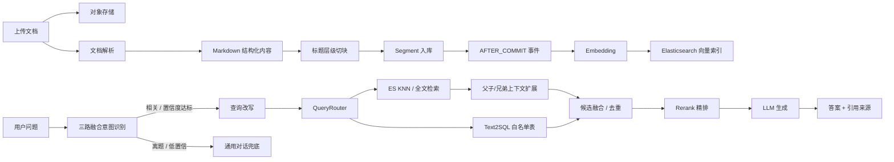

# 基于 RAG 的智能面试平台

一个以 **RAG 知识库问答与智能面试出题** 为核心的面试训练系统。

项目围绕“把技术文档、简历、JD 和面试过程沉淀成可检索、可追问、可评估的知识上下文”展开：后端负责文档解析、结构化切块、向量化、检索增强、Rerank、引用溯源和面试 Agent；前端提供知识库管理、RAG 对话、简历分析、模拟面试和模型配置等页面。

语音面试模块保留为交互扩展能力，主线能力是 **RAG 知识库构建、检索增强生成和基于知识库的自适应面试**。

## 项目定位

本项目适合作为 RAG / AI 应用方向的工程实践项目，重点体现以下能力：

- 从 PDF、Word、Markdown、TXT 等非结构化文档构建面试知识库。
- 使用 Markdown 标题层级进行语义切块，并维护父子、兄弟 chunk 关系。
- 基于 Elasticsearch 做原生 KNN 向量检索和带过滤全文检索，支持多知识库 metadata 过滤。
- 内置 RAG 检索评测接口，计算 Hit@K、MRR、NDCG 并保存评测 run。
- 补充面试场景三路融合意图识别：LLM 语义判断、本地样例相似度和关键词规则共同投票，输出综合置信度和证据。
- 提供统一评测运行接口 `/api/eval/run`，把意图识别评测、RAG 检索评测、LLM-as-Judge 回答质量评测和基线回归串成闭环。
- 通过 Query Rewrite、RetrievalAugmentor 编排、Rerank 和上下文扩展提升回答质量。
- 支持 Text2SQL 查询白名单业务表，把简历、面试记录、日程和评分统计纳入多源 RAG。
- 在流式问答中返回检索进度、引用来源和置信度信息。
- 将 RAG 能力落到面试场景：知识库检索、简历读取、Skill 出题、追问和评估。

秋招复习资料（面试问题、对标计划、架构图、简历定稿、话术库等）见 [`study/`](./study/README.md) 目录（本地个人笔记，默认不提交 git）。

## 核心功能

### RAG 知识库

- 文档上传：支持单文件和批量上传，文件存储到 S3 兼容对象存储。
- 文档解析：Markdown 直接处理，PDF/Word 等文件通过 MinerU 解析，失败时可降级到 Tika。
- 结构化切块：按 Markdown 标题层级切分，保留 `chunkId`、`parentChunkId`、`brotherChunkId`、兄弟序号等元数据。
- 异步向量化：切块事务提交后发布 `DocumentChunkedEvent`，通过 `@Async + AFTER_COMMIT` 触发向量写入。
- 向量存储：使用 LangChain4j `ElasticsearchEmbeddingStore`，以 metadata 区分用户、知识库和版本。
- 版本管理：支持上传新版本、激活/失效版本、版本切换、重新向量化和旧向量清理。
- 补偿任务：定时扫描停留在 `CHUNKED` 状态的版本，自动重试向量化。

### RAG 问答

- 多知识库问答：一次提问可关联多个知识库。
- 流式输出：SSE 返回回答 token，并推送“理解问题、检索、排序、生成”等阶段进度。
- 查询改写：结合历史对话改写用户问题，增强检索命中率。
- 检索模式：支持 `vector`、`full_text`、`hybrid` 三种模式，默认 `hybrid`（BM25 + 向量 + RRF）；Basic 许可证下应用层做 RRF 融合，不依赖 ES 原生 RRF。
- 候选融合：自定义内容聚合器兼容 LangChain4j 多检索源结果，并在进入 Rerank 前做去重和排名融合。
- Rerank 精排：默认使用 DashScope `gte-rerank-v2` 云端精排；显式配置 `provider=local` 时才启用本地 ONNX BGE Reranker。
- small-to-big 上下文扩展：命中小 chunk 后优先保留命中片段，再补充邻近兄弟 chunk 和父级章节，减少上下文碎片化。
- 引用溯源：回答末尾返回来源片段，非流式接口会返回 sources、confidence 和无效引用编号。
- 检索 Trace：保存原问题、改写问题、路由策略、命中 chunk、rerank 后顺序、最终引用和答案。
- 多源路由：QueryRouter 可将问题路由到知识库 ES、Text2SQL 或二者混合，结构化 SQL 结果跳过 Rerank 并置顶。
- Agentic RAG：查询分解（复杂/多跳/对比问题拆成子查询并行检索后 RRF 融合，规则预筛 + LLM 二次判定，默认开）+ CRAG 纠正式检索（rerank 后小模型打分 correct/ambiguous/incorrect，ambiguous 用纠正查询重检索一次，incorrect 判「知识库无据」防幻觉，默认关，按 `app.ai.rag.crag.enabled` 开启）。
- 三路融合意图识别：流式问答前用 LLM 语义识别、面试意图样例相似度、关键词规则兜底共同判断用户问题；结果包含 `intent`、`related`、`confidence`、`strategies` 和 `cached`，用于 RAG 路由、Prompt 选择和离题兜底。
- 检索评测：`/api/knowledgebase/evaluate-retrieval` 复用知识库检索链路，计算 Hit@K、MRR、NDCG，结果保存到 `rag_evaluation_runs`。
- 统一评测闭环：`/api/eval/run` 可同时跑意图识别用例、RAG 检索用例和 LLM-as-Judge 回答质量用例，保存到 `eval_runs`，并按 `baselineKey` 与最近基线比较，标记 `overallScore`、`intentAccuracy`、`intentMacroF1`、`ragHitRate`、`judgeAverageOverall` 等指标是否退化。
- 会话管理：支持创建 RAG 会话、历史消息、置顶、重命名和关联知识库调整。

### 表格与结构化数据

- CSV/TSV 解析：保留表头、Markdown 表格和按行展开的键值记录。
- Excel 解析：使用 Apache POI 读取 `.xls/.xlsx` 的 sheet、行和单元格，失败时降级 Tika 文本解析。
- Text2SQL：仅暴露 `resumes`、`resume_analyses`、`interview_sessions`、`interview_answers`、`interview_schedule` 白名单表。
- 安全边界：Text2SQL 只允许 SELECT/WITH、禁 UNION/INTERSECT/EXCEPT 与多语句、禁 OR 绕过；多表 JOIN 时逐表强制 `user_id = 当前用户` 约束（防只约束一张表 JOIN 出他人数据），并用只读 DataSource 强制连接只读。生产环境仍建议为 Text2SQL 配置数据库只读账号。

### 智能面试

- Skill 出题：内置 Java 后端、前端、算法、系统设计、AI Agent、阿里/字节/腾讯专项等方向。
- JD 解析：根据岗位描述匹配面试 Skill 和考察范围。
- Multi-Agent 自适应出题：Planner→Interviewer→Critic 显式状态机 + Reflexion，Interviewer 可调用知识库检索、简历读取等工具后生成下一题。
- 文字模拟面试：支持创建会话、获取当前问题、提交/修改回答、结束会话；可查看 Agent 轨迹与计划进度。
- 异步评估：通过消息队列（默认 RocketMQ 事务消息，可回退 Redis Stream）触发面试评估任务，统一生成评分、反馈、优势和改进建议。
- PDF 导出：支持导出面试报告和简历分析报告。

### 简历与日程

- 简历上传和解析：支持 PDF、Word、TXT，解析后异步生成 AI 分析。
- 简历库：查看历史简历、分析状态、详情和导出报告。
- 面试安排：维护公司、岗位、轮次、时间、会议链接和状态。
- 邀约解析：规则解析常见邀约文本，规则失败后可调用 LLM 补充解析。

### 系统能力

- 用户认证：注册、登录、刷新 token，使用 JWT 做接口鉴权。
- 多模型配置：支持 DashScope、Kimi、DeepSeek、GLM、LM Studio 等 OpenAI 兼容 Provider。
- 默认模型切换：可配置默认 ChatModel 和 EmbeddingModel。
- 接口限流：基于 `@RateLimit` 和 Redis Lua 脚本实现多维度限流。
- 分布式锁：知识库上传、切块、版本切换等写操作使用 Redisson 锁防并发冲突。
- 指标监控：暴露 Actuator、Prometheus 指标，覆盖 RAG 流式延迟、结构化输出、异步队列等。

## RAG 主链路



## 统一评测闭环

本项目新增统一评测运行接口，用来把“功能可用”进一步落到“指标可追踪、版本可回归”。

- 接口：`POST /api/eval/run`
- 覆盖范围：面试场景意图识别用例、RAG 检索评测用例、LLM-as-Judge 回答质量用例。
- 持久化：每次运行保存到 `eval_runs`，RAG 检索明细仍复用 `rag_evaluation_runs`。
- 基线对比：请求中可传 `baselineKey` 和 `updateBaseline`；普通运行会与同一 `baselineKey` 下最近一次基线比较。
- 退化判断：按 `regressionThreshold` 判断 `overallScore`、意图识别准确率、Macro-F1、RAG Hit@K / MRR / NDCG、裁判平均分和裁判通过率是否明显下降。

最小请求示例：

```json
{
  "title": "面试路由基础回归",
  "baselineKey": "interview-routing-basic",
  "updateBaseline": false,
  "regressionThreshold": 0.03,
  "intentCases": [
    {
      "question": "讲讲 JVM 垃圾回收原理",
      "expectedIntent": "TECH_KB"
    },
    {
      "question": "今天天气怎么样",
      "expectedIntent": "OFF_TOPIC"
    }
  ],
  "rag": {
    "knowledgeBaseIds": [1],
    "k": 5,
    "items": [
      {
        "question": "Redis 缓存穿透怎么解决？",
        "expectedKeywords": ["布隆过滤器", "空值缓存"],
        "expectedChunkIds": []
      }
    ]
  },
  "judgeCases": [
    {
      "question": "Redis 缓存穿透怎么解决？",
      "answer": "可以用布隆过滤器拦截不存在的 key，并对不存在的数据做短 TTL 空值缓存。",
      "referenceAnswer": "布隆过滤器、参数校验、空值缓存、热点保护。",
      "context": "缓存穿透指查询不存在的数据导致请求打到数据库。",
      "minOverallScore": 0.75
    }
  ]
}
```

## RAG 检索评测结果

本地使用 5 类 Java 后端面试 PDF（Redis、MySQL、分布式、JVM、Spring）构建知识库，按 `eval/rag-retrieval/eval-dataset.yaml` 的 80 题评测集跑完整检索对照实验。报告产物见 `eval/.work/rag-retrieval-report.md`（本地临时目录，不进 git）。

> 判定口径：关键点覆盖率按「关键点同义词组是否在召回 chunk 文本中命中」计算，属近似匹配代理指标，绝对值（含 MRR/命中率）偏乐观；四档策略同口径对照，**结论应看各档相对增益**（如标准问法 +5.7pp、困难问法 +4.3pp），而非单点绝对值。

| 查询变体 | 策略 | 关键点覆盖率 | 关键点命中率 | 来源命中率 | MRR | NDCG@6 |
| --- | --- | --- | --- | --- | --- | --- |
| 标准问法 | vector | 90.2% | 100.0% | 96.3% | 0.9792 | 0.5351 |
| 标准问法 | hybrid+rerank+expand | 95.9% | 100.0% | 97.5% | 0.9938 | 0.5386 |
| 困难口语化 | vector | 89.7% | 100.0% | 97.5% | 0.9463 | 0.5828 |
| 困难口语化 | hybrid+rerank+expand | 94.0% | 100.0% | 97.5% | 0.9479 | 0.5575 |

复现命令：

```bash
RAGEVAL_KB_REDIS=9 RAGEVAL_KB_MYSQL=10 RAGEVAL_KB_DISTRIBUTED=11 RAGEVAL_KB_JVM=12 RAGEVAL_KB_SPRING=13 \
mvn -pl backend test -Dtest=RagRetrievalEvalTest '-Dtest.excludedGroups=' -Dgroups=rag-eval
```

## RAGAS 生成质量基线

同一套 80 题通过 `POST /api/knowledgebase/eval/export-qa` 走完整 RAG 生成链路导出 QA，再用 RAGAS 评测生成质量。报告产物见 `eval/ragas/.work/ragas-report-20260703-104149.md`（本地临时目录，不进 git）。

| 指标 | 得分 | 说明 |
| --- | --- | --- |
| faithfulness | 0.6194 | 回答是否忠于召回上下文 |
| answer_relevancy | 0.5089 | 回答与问题的相关性 |
| llm_context_precision_with_reference | 0.5391 | 相关上下文是否排在前面 |
| context_recall | 0.4750 | 上下文对参考要点的覆盖 |

复现命令：

```bash
cd eval/ragas
uv sync
uv run run_ragas.py --from-jsonl .work/qa-export-20260703-103205.jsonl
```

## 技术栈

### 后端

| 类型 | 技术 |
| --- | --- |
| 基础框架 | Spring Boot 3.5.6、Java 21、虚拟线程 |
| AI 编排 | LangChain4j 1.11.0、AiServices、RetrievalAugmentor |
| 模型接入 | OpenAI 兼容接口、DashScope、Kimi、DeepSeek、GLM、LM Studio |
| 向量检索 | Elasticsearch 8.17、LangChain4j ElasticsearchEmbeddingStore |
| 关系数据库 | MySQL 8、MyBatis-Plus、Druid |
| 缓存与异步 | Redis、RocketMQ（默认，事务消息 + broker 重试 + DLQ）/ Redis Stream（回退） |
| 文档解析 | MinerU、Apache Tika、Apache POI |
| 文件存储 | S3 兼容对象存储，完整容器环境使用 MinIO，开发依赖可用 RustFS |
| 精排 | DashScope `gte-rerank-v2`，可选本地 ONNX BGE Reranker |
| 导出 | iText 8 |
| 监控 | Spring Boot Actuator、Micrometer、Prometheus |

### 前端

| 类型 | 技术 |
| --- | --- |
| 基础框架 | React 18、TypeScript、Vite |
| 样式 | Tailwind CSS 4 |
| 路由 | React Router |
| 动效与图表 | Framer Motion、Recharts |
| Markdown 展示 | react-markdown、remark-gfm、react-syntax-highlighter |
| 大列表 | react-virtuoso |
| 日历 | React Big Calendar |

## 目录结构

```text
ai-interview
├── backend
│   ├── src/main/java/com/linrun/interview
│   │   ├── common                  # 通用基础能力：鉴权、限流、锁、AI Provider、异步模板
│   │   ├── infrastructure          # 文件、Redis、PDF、MapStruct 等基础设施
│   │   └── modules
│   │       ├── knowledgebase        # RAG 知识库、版本、切块、检索、会话问答
│   │       ├── interview            # 模拟面试、Skill、Agent、异步评估
│   │       ├── resume               # 简历上传、解析、AI 分析
│   │       ├── interviewschedule    # 面试日程和邀约解析
│   │       ├── llmprovider          # 多模型配置和默认模型切换
│   │       ├── user                 # 注册、登录、JWT
│   │       └── voiceinterview       # 语音面试扩展
│   └── src/main/resources
│       ├── sql/schema.sql           # MySQL 初始化脚本
│       ├── prompts                  # RAG、面试、简历分析提示词
│       └── skills                   # 面试方向 Skill 定义
├── frontend
│   └── src
│       ├── api                      # 后端 API 封装
│       ├── components               # 通用组件和业务组件
│       └── pages                    # 知识库、RAG 对话、简历、面试、设置页面
├── eval                            # 评测与压测（k6、RAG 评测集）
│   ├── loadtest/                   # k6 接口压测脚本
│   ├── rag-retrieval/              # RAG 召回质量评测集（80 题）
│   ├── ragas/                      # RAGAS 生成质量评测
│   └── corpus/                     # 评测 PDF 语料（本地，不进 git）
├── dev-ops/                        # Docker / RocketMQ / 监控运维（见 dev-ops/README.md）
├── study/                          # 秋招复习资料（本地笔记，不进 git）
├── docker-compose.dev.yml           # → dev-ops/docker-compose-environment.yml
├── docker-compose.yml               # → dev-ops/docker-compose-app.yml
├── docker-compose.monitor.yml       # → dev-ops/docker-compose-monitor.yml
```

## 快速开始

### 环境要求

- JDK 21
- Maven 3.9+
- Node.js 20+
- pnpm 10+
- Docker / Docker Compose
- DashScope API Key，至少用于默认 LLM 和 Embedding

### 1. 配置环境变量

复制示例配置：

```bash
cp .env.example .env
```

至少填写：

```properties
AI_BAILIAN_API_KEY=your_dashscope_api_key_here
AI_MODEL=qwen3.5-flash
```

如果只跑 RAG 主链路，语音相关配置可以先不管。

### 2. 启动本地依赖

推荐开发方式是只用 Docker 启动基础设施，后端和前端在本机运行：

```bash
cd dev-ops
docker compose -f docker-compose-environment.yml up -d
```

或在项目根目录：

```bash
docker compose -f docker-compose.dev.yml up -d
```

详见 [`dev-ops/README.md`](dev-ops/README.md)。

该文件会启动：

- MySQL：`localhost:33306`
- Redis：`localhost:26379`
- Elasticsearch：`localhost:29200`
- MinIO：API `localhost:29000`，控制台 `localhost:29001`
- Neo4j：HTTP `localhost:27474`，Bolt `localhost:27687`
- RocketMQ：namesrv `localhost:9876`，broker `10911`，控制台 `localhost:29888`

MinIO bucket `ai-interview` 由 compose 自动创建；账号密码见 `.env.example` 中的 `MINIO_*` / `APP_STORAGE_*`。

### 3. 启动后端

```bash
cd backend
mvn spring-boot:run
```

> 注意：`spring-boot:run` 需要在 `backend` 模块目录内执行；在根目录用 `-pl backend -am` 会因聚合模块无 main class 报错。

后端默认端口为：

```text
http://localhost:8082
```

Swagger UI：

```text
http://localhost:8082/swagger-ui.html
```

### 4. 启动前端

```bash
cd frontend
pnpm install
pnpm dev
```

前端开发端口在 `frontend/vite.config.ts` 中配置为：

```text
http://localhost:5174
```

Vite 已将 `/api` 代理到 `http://localhost:8082`。

### 5. 完整容器化启动

如果不想分别启动前后端，可以直接使用完整 Compose（**不要**与 `docker-compose.dev.yml` 同时 up，会重复创建同名容器）：

```bash
cd dev-ops
docker compose -f docker-compose-app.yml up -d --build
```

或在项目根目录：

```bash
docker compose -f docker-compose.yml up -d --build
```

默认宿主机端口：

```text
前端：http://localhost:28080
后端：http://localhost:28082
MySQL：localhost:33306
Redis：localhost:26379
Elasticsearch：http://localhost:29200
MinIO：http://localhost:29001
```

## Rerank 模型说明

RAG 默认使用 DashScope 云端 `gte-rerank-v2` 精排：

```properties
APP_AI_RAG_RERANK_PROVIDER=cloud
```

如果你希望使用本地精排，再显式切换：

```properties
APP_AI_RAG_RERANK_PROVIDER=local
```

本地模型文件较大，不进入 Git。请按该目录下的 README 下载：

```text
backend/src/main/resources/model/bge-reranker-model/
model_quantized.onnx
tokenizer.json
```

或者关闭精排：

```properties
APP_AI_RAG_RERANK_ENABLED=false
```

## 常用接口

| 模块 | 接口 |
| --- | --- |
| 认证 | `POST /api/auth/register`、`POST /api/auth/login` |
| 知识库 | `POST /api/knowledgebase/upload`、`GET /api/knowledgebase/list` |
| 批量上传 | `POST /api/knowledgebase/upload/batch` |
| RAG 问答 | `POST /api/knowledgebase/query`、`POST /api/knowledgebase/query/stream` |
| RAG 检索评测 | `POST /api/knowledgebase/evaluate-retrieval` |
| 统一评测闭环 | `POST /api/eval/run` |
| RAG Trace | `GET /api/knowledgebase/traces`、`GET /api/knowledgebase/traces/{traceId}` |
| 表格数据预览 | `GET /api/knowledgebase/{id}/data/preview` |
| RAG 会话 | `POST /api/rag-chat/sessions`、`POST /api/rag-chat/sessions/{id}/messages/stream` |
| 知识库版本 | `GET /api/knowledgebase/{id}/versions`、`POST /api/knowledgebase/{id}/versions/{versionId}/switch` |
| 简历 | `POST /api/resumes/upload`、`GET /api/resumes` |
| 面试 | `POST /api/interview/sessions`、`GET /api/interview/sessions/{sessionId}/question` |
| Agent 轨迹 | `GET /api/interview/sessions/{sessionId}/agent-trace`、`GET .../agent-plan` |
| 候选人记忆 | `GET /api/interview/candidate-memory/profile` |
| Skill | `GET /api/interview/skills`、`POST /api/interview/skills/parse-jd` |
| 模型配置 | `GET /api/llm-provider/list`、`PUT /api/llm-provider/default-provider` |

## 配置重点

常用配置都在 `backend/src/main/resources/application.yml` 中，支持通过 `.env` 覆盖：

| 配置 | 说明 |
| --- | --- |
| `app.ai.default-provider` | 默认聊天模型 Provider |
| `app.ai.default-embedding-provider` | 默认 Embedding Provider |
| `elasticsearch.host` | Elasticsearch 地址 |
| `elasticsearch.index-name` | 向量索引名称 |
| `elasticsearch.num-candidates` | ES hybrid/KNN 候选数量 |
| `app.ai.rag.rewrite.enabled` | 是否启用查询改写 |
| `app.ai.rag.search.*` | 召回数量和最低分阈值 |
| `app.ai.rag.hybrid.enabled` | 是否允许混合检索链路 |
| `app.ai.rag.hybrid.mode` | `hybrid` / `vector` / `full_text`，默认 `hybrid` |
| `app.ai.rag.sql.enabled` | 是否启用 Text2SQL |
| `app.ai.rag.sql.router-enabled` | 是否启用 LLM 多源 QueryRouter |
| `app.ai.rag.rerank.enabled` | 是否启用 Rerank |
| `app.ai.rag.rerank.provider` | `cloud` / `local`，默认 `cloud` |
| `app.ai.rag.parent-expand.enabled` | 是否启用父子/兄弟上下文扩展 |
| `app.ai.rag.intent-recognition.enabled` | 是否启用 RAG 意图识别 |
| `app.ai.rag.decompose.enabled` | 是否启用 Agentic RAG 查询分解（复杂问题拆子查询，默认开） |
| `app.ai.rag.crag.enabled` | 是否启用 Agentic RAG CRAG 纠正式检索（默认关，每次查询多一次小模型打分） |
| `app.storage.*` | S3 兼容对象存储配置 |
| `app.security.jwt.*` | JWT 配置（生产必须设 `APP_JWT_SECRET`，用默认值后端拒绝启动） |

## 测试与构建

后端测试：

```bash
mvn -pl backend test
```

本次 RAG 核心链路的轻量验证：

```bash
mvn -pl backend "-Dtest=InterviewQueryRouterTest,ReadOnlyDataSourceTest,InterviewHybridContentAggregatorTest,SpreadsheetProcessServiceTest,RagEvaluationServiceTest" test
```

RAG 检索质量全量评测（需要真实 MySQL / Redis / Elasticsearch / DashScope，并提前导入 5 类语料）：

```bash
mvn -pl backend test -Dtest=RagRetrievalEvalTest '-Dtest.excludedGroups=' -Dgroups=rag-eval
```

面试 Agent Critic 质量门评测（bad case 回归集，需要 DashScope，仅需 `AI_BAILIAN_API_KEY`）：

```bash
mvn -pl backend test -Dtest=InterviewCriticEvalTest '-Dtest.excludedGroups=' -Dgroups=agent-eval
```

评测集见 `eval/interview-agent/critic-badcase-dataset.yaml`（13 条：越界/难度错配/重复/prompt 注入/含糊 + 正例），
报告写到 `eval/.work/critic-badcase-report.md`。设置 `CRITIC_EVAL_MIN_ACCURACY` 后低于阈值断言失败（供 CI 门禁）。
本地一轮 qwen3.5-flash 结果：整体准确率 1.0，打回 Precision/Recall/F1 均为 1.0（9 个 bad case 全部拦截，4 个正例全部放行）。

前端构建：

```bash
cd frontend
pnpm build
```

后端打包：

```bash
mvn -pl backend -am package -DskipTests
```

## 备注

- 完整容器化部署可参考 `dev-ops/docker-compose-app.yml`（根目录 `docker-compose.yml` 为兼容入口），但日常开发更推荐 `dev-ops/docker-compose-environment.yml + 本机后端 + 本机前端`。
- Windows + Docker Desktop（WSL2 mirrored 网络模式）下，宿主机 RocketMQ 客户端可能无法连通容器发布的 `9876` 端口（TCP 握手成功但数据被转发层丢弃）。本机开发可在 `.env` 设置 `APP_ASYNC_ENGINE=redis-stream` 回退轻量引擎；完整容器化部署（应用与 RocketMQ 同网络）不受影响，仍走默认 RocketMQ。
- 语音面试依赖 ASR/TTS 和浏览器麦克风权限，属于扩展交互能力；如果只展示 RAG 项目，可以不作为主讲内容。
- 本地 Elasticsearch Basic 许可证不支持 ES 原生 RRF；本项目在应用层做 RRF 融合。默认 `hybrid` 模式可用；若仅跑向量链路可设 `APP_AI_RAG_HYBRID_MODE=vector`。
- Text2SQL 应使用生产只读数据库账号；应用层只读连接是额外保护，不替代数据库权限。
- 表结构以 `backend/src/main/resources/sql/schema.sql` 为准；Schema 变更需同步更新该文件。
