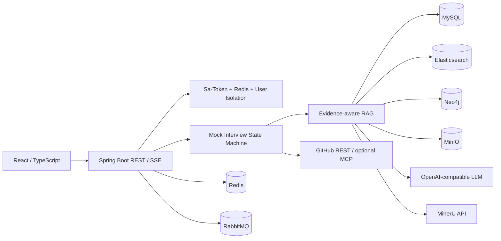

# AI 面试教练平台

# AI Interview Copilot

## 项目简介

AI Interview Copilot 是一套面向候选人的全栈面试准备平台。系统把简历、岗位资料、项目文档和公开仓库快照沉淀为带版本、权限与引用的证据，再按问题意图选择数据源生成可追溯回答；模拟面试由 Java 状态机持有会话事实，完成出题、审题、追问和复盘。

本服务提供知识库生命周期、意图门控问答、多源检索（Elasticsearch / Text2SQL / Text2Cypher）、文字模拟面试、候选人记忆、异步报告与统一评测接口。适合本地开发与单机约 4C6G 量级演示，不是通用 ChatBot，也不是「切块 + 向量 + LLM」的单次检索 Demo。

## 系统架构

### 架构特点

- **前后端分离**：React 前端 + Spring Boot REST / SSE
- **知识引擎与面试领域分离**：公共引擎只提供可复用能力，`business` 负责把能力编排成面试产品
- **证据化 RAG**：MinIO 私有对象、结构感知切块、混合检索、引用闸门与阶段化 Trace
- **显式状态机编排**：Planner / Interviewer / Critic，有界 Reflexion，不引入第二状态源
- **异步最终一致**：RabbitMQ 承载长任务；文档向量化走提交后事件、租约与补偿
- **数据隔离**：Sa-Token + Redis 会话，身份经 `UserContext` 贯穿检索、面试、文件与异步任务
- **可观测**：业务 Trace、Micrometer / Prometheus / Grafana；日志查询走独立 ELK Compose

### 核心领域

系统按「知识引擎 + 面试领域 + 外部适配」划分边界：

- **知识引擎（`ai` / `auth` / `chat` / `document` / `rag` / `infra`）**：模型与 Provider、认证、通用聊天、文档生命周期、多源 RAG、锁 / MQ / 观测
- **面试领域（`business`）**：模拟面试、简历、能力画像、会话状态、候选人记忆、Agent 编排与报告
- **外部适配（`github`）**：只读公开仓固定 Commit SHA 取证；可选官方远程 MCP，失败回退快照

### 模块结构

```text
ai-interview/
├── backend/                 # Spring Boot 后端
│   └── com.linrun.interview
│       ├── ai/              # LLM Provider、Prompt、用量
│       ├── auth/            # 注册登录、Sa-Token 会话
│       ├── chat/            # 通用聊天与 RAG 会话消息
│       ├── document/        # 知识库、解析、切块、版本、补偿
│       ├── rag/             # 意图、改写、路由、检索、引用、Trace、评测接口
│       ├── business/        # 模拟面试、简历、记忆、Agent、报告
│       ├── github/          # 公开仓只读取证
│       ├── infra/           # Redis / MQ / 锁 / 雪花 ID / 观测
│       ├── common/          # 异常码、统一返回
│       └── config/          # Spring / MyBatis / XXL-Job
├── frontend/                # React 18 + TypeScript + Vite
└── dev-ops/                 # Compose、监控与开发检查
```

`business` 按 MVC 平铺；RAG 的意图、改写、路由、检索、聚合、重排、引用与评测均落在 `rag/service`，由独立类表达技术阶段。



## 核心功能

### 1. 知识库与文档生命周期

- **文件接入**：PDF、Word、Excel、CSV、Markdown、TXT；原文件进 MinIO，元数据与版本进 MySQL
- **解析**：PDF/DOC/HTML 优先官方 MinerU 云 API，失败降级 Tika；MD/TXT 走 Markdown 处理
- **双路线**：`DOCUMENT_SEARCH` 切块入库；`DATA_QUERY` 把 Excel/CSV 落到动态表，不切块不向量化
- **结构感知切片**：默认父子策略，过长章节生成兄弟块；Excel 文档检索按行切块
- **版本与补偿**：仅当前发布版本进入默认召回；解析、切片、Embedding 带状态、租约、CAS 与重试

### 2. 意图门控与多源 RAG

- **领域门**：相关才检索，越域走普通闲聊，避免无关召回
- **数据源路由**：技术知识 / 八股 → Elasticsearch；分数统计 / 列表 → MySQL 只读 Text2SQL；调用链 / 依赖 → Neo4j 只读 Text2Cypher
- **混合检索**：BM25 + 向量 + RRF；非结构化候选走本地 BGE 重排；SQL/Cypher 结果跳过重排
- **命中后扩展**：子块命中后再追加父块 / 兄弟块；关系存在 MySQL，必要时 Redis 缓存，不写入 Neo4j
- **引用闸门**：回答只能引用本次检索来源；闸门三态 `pass` / `grounded` / `need_escalate`
- **SSE 与 Trace**：进度、路由、引用卡片与回答 Token 分阶段推送，决策可回放

### 3. Multi-Agent 模拟面试

- **主链路**：创建会话 → Planner → Interviewer（可读简历）→ Critic → 有界 Reflexion → 作答 → `DEEPEN` / `CLARIFY` / `REMEDIATE` / `SWITCH_TOPIC` → 下一题
- **状态机**：`PLANNING → ASKING → CRITIQUING` 等阶段只在 Java 侧维护，不跑自由 AgentLoop
- **记忆**：短期窗口保留近 1～2 轮原文；本场用答题信号摘要；跨场 `CandidateMemory` 按评估分沉淀
- **回退**：`app.ai.agent.enabled=false` 时退回旧批量出题，这是运行策略，不是删除功能
- **轨迹**：Agent Trace 可回放重试与降级

### 4. 报告、画像与外部取证

- **报告**：面试结束后异步汇总逐题评估与 PDF 复盘，不输出录用概率
- **能力画像**：跨场聚合强弱项；Planner 最多注入 8 条已验证记忆
- **GitHub**：只读公开仓固定 Commit SHA，白名单与敏感文件检测；不收私有令牌、不写仓库
- **平台不对外暴露通用 MCP Server**

### 5. 安全与可靠性

- 登录鉴权、按用户隔离、模型访问凭证加密存储
- Text2SQL 仅白名单表 + 单条 `SELECT`，用户域绑定当前 `user_id`
- Text2Cypher 仅 `MATCH/RETURN`，可强制 `ownerUserId`
- 长任务有界重试、Redisson 锁、XXL-Job 或 `@Scheduled` 补偿，避免永久卡在处理中

## 技术栈

### 后端

- **框架**：Spring Boot 3.5.x、Sa-Token 1.39 + Redis
- **ORM / 连接池**：MyBatis-Plus 3.5.x、Druid
- **AI**：LangChain4j 1.11.x（OpenAI 兼容、Elasticsearch、Neo4j、ONNX Scoring）
- **数据**：MySQL 8、Redis、Elasticsearch、Neo4j、MinIO
- **消息与调度**：RabbitMQ、XXL-JOB 2.4.0
- **锁与解析**：Redisson 3.52、Apache Tika、EasyExcel、MinerU 官方 API
- **观测**：Micrometer、Prometheus、Grafana
- **JDK**：21

### 前端与工程

- **前端**：React 18、TypeScript、Vite、Tailwind CSS 4
- **构建**：Maven 3.9+、pnpm
- **测试**：JUnit 5、Mockito、AssertJ、Vitest
- **部署**：Docker Compose

## 技术亮点

### 1. 意图门控与多数据源路由

不是所有问题都进 Elasticsearch。系统先判断是否属于面试 / 技术域：相关才检索，越域走普通聊天。进入检索后再按业务意图选源——语义资料走 ES，精确统计走 Text2SQL，关系遍历走 Text2Cypher。路由失败、源不可用或无结果时回退 ES；结构化结果作为一等证据保留，不和向量候选混着重排。

### 2. 结构感知切片与命中后扩展

入库不是固定字数一刀切。默认按 Markdown 标题做父子切片，并为过长章节生成兄弟块。父子 / 兄弟关系保存在 MySQL 分段表，检索命中子块后再补父上下文和同组兄弟，避免精确证据被大段摘要盖住。Neo4j 只承担平台实体关系查询，和切片拓扑不是一回事。

### 3. 混合检索与本地重排

Elasticsearch 同时做 BM25 与向量召回，RRF 融合后由进程内 BGE ONNX 重排（模型文件不入库，缺失时退回 RRF 顺序，无云端 rerank 降级）。编排是 `HybridContentAggregator` 包住重排与上下文扩展，不是四段线性串联。查询始终带用户、知识库、当前发布版本和 `PLATFORM / JOB / CANDIDATE / GITHUB` 证据范围。

### 4. 显式状态机 Multi-Agent

面试事实只在 Java 状态机中。Planner、Interviewer、Critic 分工明确；出题先过 `QuestionGroundingValidator`，打回经有界 Reflexion 重回提问，达到上限则采用最后版本，避免无限重试和第二套状态源漂移。作答后由规则选择加深、澄清、补救或换题，不把「判对错」交给自由循环。

### 5. 引用闸门、SSE 与阶段化 Trace

SSE 先发引用列表，再流式输出 Token；结束后校验引用编号、覆盖率和置信度。前端看到的是进度、路由、引用卡片和回答正文，而不是一段不可解释文本。路由、召回、重排、降级原因写入阶段化 Trace，便于回放「为什么这样答」。

### 6. 文档生命周期与最终一致

原文件与解析产物进 MinIO；版本与分段进 MySQL；向量进 Elasticsearch。单文件上传可在请求内同步 convert，批量上传走提交后事件。向量化在 split 后由 `DocumentChunkedEvent` 异步触发，配合租约、CAS、Redisson 锁和补偿任务，使 MySQL 与 ES 收敛到当前发布版本。

## 环境要求

- **JDK**：21+
- **Maven**：3.9+
- **Node.js**：20+、pnpm
- **Docker Desktop / Docker Engine**
- **依赖服务**：MySQL 8、Redis、Elasticsearch、MinIO、RabbitMQ、Neo4j（可由 Compose 拉起）
- **可选**：XXL-JOB（生产补偿）、MinerU Token、兼容 OpenAI 接口的对话模型

## 快速开始

### 1. 环境准备

确保已安装 JDK 21、Maven、Node.js 20+、pnpm 与 Docker。

### 2. 本地配置

从模板创建本机配置，只在本地 `.env` 填写真实服务访问信息（不要提交该文件）：

```powershell
$ErrorActionPreference = 'Stop'
Copy-Item .env.example .env
```

### 3. 启动依赖

```powershell
$ErrorActionPreference = 'Stop'
docker compose -f dev-ops/docker-compose-environment.yml up -d
```

本地依赖包含 MySQL、Redis、Elasticsearch、MinIO、RabbitMQ 和 Neo4j；Neo4j 不使用 profile，执行上面的命令会直接启动。需要日志查询或监控时，分别使用 `dev-ops/docker-compose-elk.yml` 和 `dev-ops/docker-compose-grafana.yml`。

知识库默认按 `PARENT_CHILD` 父子策略切块。父子、兄弟关系只用于 ES 命中后的上下文扩展，由 MySQL / Redis 保存和读取，不会写入 Neo4j。Neo4j 启动后自动导入 `backend/src/main/resources/neo4j/ai-interview-domain.json`，用于 Agent、LangChain、LangGraph、RAG 等平台实体关系查询；失败时由补偿任务重试。

V2 不迁移旧数据，也不提供旧表兼容层。切换版本时删除旧 MySQL / ES / Redis 数据卷，由 `backend/src/main/resources/sql/schema.sql` 在全新数据卷首次初始化完整结构。

全新数据卷可先清卷再拉起：

```powershell
$ErrorActionPreference = 'Stop'
docker compose -f dev-ops/docker-compose-environment.yml down -v
docker compose -f dev-ops/docker-compose-environment.yml up -d
```

### 4. 启动后端

```powershell
$ErrorActionPreference = 'Stop'
mvn -pl backend spring-boot:run
```

### 5. 启动前端

```powershell
$ErrorActionPreference = 'Stop'
pnpm -C frontend install
pnpm -C frontend dev
```

- 前端默认：`http://localhost:5174`
- 后端默认：`http://localhost:8082`
- Swagger：`http://localhost:8082/swagger-ui.html`

首次使用对话类功能前，请在「设置 → 我的模型」填写兼容 OpenAI 接口的 Base URL、访问凭证与模型名。文档向量化仍使用平台侧配置。

## 项目结构说明

### 知识引擎

`ai` 管理用户 / 全局模型配置与 Prompt；`document` 负责上传、解析、切块、版本发布与补偿；`rag` 负责意图、改写、多源路由、混合检索、引用闸门、Trace 与评测接口；`chat` 承载通用会话消息；`auth` 与 `infra` 提供身份和基础设施。

### 面试领域

`business` 持有模拟面试状态机、简历、能力画像、`CandidateMemory`、Agent 轨迹和异步报告。跨表事务、外部 IO 和编排由领域 Service 明确控制，不用通用 CRUD 掩盖边界。

### 前端

`frontend/src/pages` 对应知识库、RAG 问答、模拟面试、简历、日程、设置与 Trace 回放；`features` 按业务聚合 API 与组件，路由与侧栏分组保持一致。

### 本地评测

评测脚本、黄金集与结果报告在本地 `eval/` 目录，默认不纳入版本控制。仓库内可核对的是后端评测接口与 `rag` 包实现，不是离线数字本身。

## 部署说明

### 本地全栈 Compose

`dev-ops/docker-compose-app.yml` 一键拉起依赖、XXL-Job、后端和前端，默认按单机 4C6G 限内存：

```powershell
docker compose --project-directory dev-ops --env-file .env `
  -f dev-ops/docker-compose-app.yml up -d --build
```

默认访问：前端 `http://localhost:28080`，后端健康检查 `http://localhost:28082/actuator/health`。上线把 `COMPOSE_PUBLISH_HOST=127.0.0.1`，公网只暴露前端。详细端口与内存参数见 `dev-ops/README.md`。

### 生产注意

- Provider API Key 加密密钥 `APP_AI_CONFIG_ENCRYPTION_KEY` 必须非空，并打开 `APP_AI_CONFIG_REQUIRE_ENCRYPTION_KEY`
- 不要关掉 Neo4j 或 XXL-Job 来「减配」；ELK / Grafana 按需另起
- 真实访问凭证、完整 Prompt、简历与源码正文不得写入日志或提交记录

## 监控与运维

### 日志

- 应用使用 Logback
- 需要检索日志时启动 `dev-ops/docker-compose-elk.yml`，复用本地 Elasticsearch

### 任务调度

- 生产由 XXL-JOB 接管同名 Handler（如 `ragEmbeddingCompensation`、`ragMineruParseCompensation`）
- 关闭 XXL-JOB 时仍由 `@Scheduled` 补偿，保证解析与向量化最终收敛

### 指标

- Actuator + Micrometer 暴露 Prometheus 指标
- `dev-ops/docker-compose-grafana.yml` 提供 Prometheus + Grafana

## 本地验证

常用门禁：

```powershell
$ErrorActionPreference = 'Stop'
mvn -pl backend -am clean test
pnpm -C frontend test -- --run
pnpm -C frontend exec tsc --noEmit
pnpm -C frontend build
./dev-ops/ci/Test-ReleaseContent.ps1
./dev-ops/ci/Test-ComposeConfig.ps1
./dev-ops/ci/Test-PowerShellSyntax.ps1
./dev-ops/ci/Test-FreshSchema.ps1
```

上述结果证明构建、单测与 Compose 配置门禁；不代表全部外部服务 E2E 或 24 小时稳定性已验收。默认 Surefire 排除 `rag-eval`、`agent-eval` 两组（需真实 ES / 模型）。

## 项目范围

- 主能力是知识库问答、多源 RAG、文字模拟面试、候选人记忆与评测接口
- GitHub 只读公开仓固定 Commit SHA，不读私库、不收私有令牌、不写仓库
- 候选人简历、岗位资料、回答与源码按用户隔离，不进入公共知识域

## 开发规范

- 后端采用领域化分包与异常码约定；新版本以完整 `schema.sql` 初始化，不保留旧表迁移脚本
- 单表 CRUD 可用 MyBatis-Plus `ServiceImpl`；跨表事务、状态机和 Agent / RAG 编排必须走领域 Service
- 前端路由与侧栏分组保持一致；用户可见文案避免暴露内部实现黑话
- 真实访问凭证、完整 Prompt、简历与源码正文不得写入日志、脚本参数或提交记录
