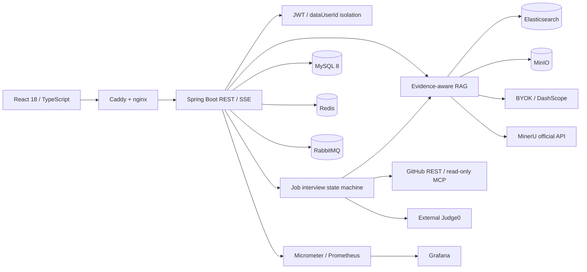
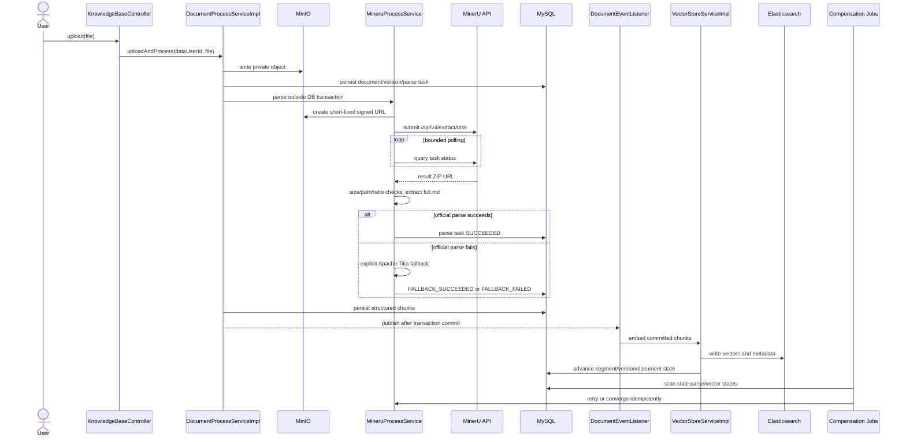
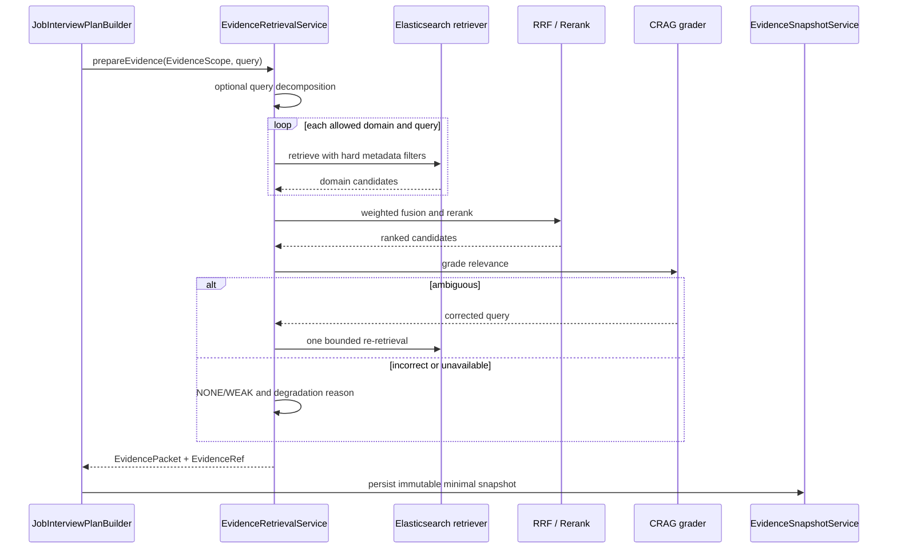
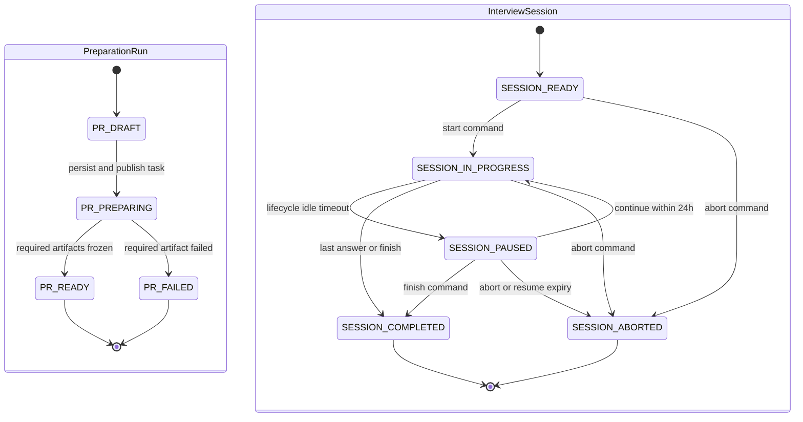

# 架构与核心调用链

本文描述当前 V1 代码事实，供本地维护、部署核验和秋招答辩使用。设计目标是 4C6G、5 人以内的
单机部署；本地自动化通过不等于已经完成真实外部 API E2E 或 24 小时服务器观察。

## 1. 系统边界



边界原则：

- MySQL 是业务事实源；Redis 只保存缓存、短期运行态和会话记忆。
- Elasticsearch 保存可重建的检索索引，不承担用户归属判断；查询仍必须携带显式证据范围。
- MinIO 桶保持私有，MinerU 只通过短时签名 URL 读取指定对象。
- 用户触发的生成式请求走 BYOK；Embedding、云 Rerank 与系统任务使用平台配置。
- Judge0 执行不可信源码，应用服务器自身不运行候选人代码。
- GitHub 只支持公开仓库、固定 SHA 和只读操作，不接收候选人 PAT。

## 2. RAG 文档时序



关键实现：

- API 与文档编排：
  [`KnowledgeBaseController`](../backend/src/main/java/com/linrun/interview/modules/knowledgebase/KnowledgeBaseController.java)、
  [`DocumentProcessServiceImpl`](../backend/src/main/java/com/linrun/interview/modules/knowledgebase/service/DocumentProcessServiceImpl.java)
- MinerU 与 ZIP 安全：
  [`OfficialMineruClient`](../backend/src/main/java/com/linrun/interview/modules/knowledgebase/service/parse/mineru/OfficialMineruClient.java)、
  [`MineruZipExtractor`](../backend/src/main/java/com/linrun/interview/modules/knowledgebase/service/parse/mineru/MineruZipExtractor.java)
- 状态与补偿：
  [`DocumentParseTaskService`](../backend/src/main/java/com/linrun/interview/modules/knowledgebase/service/DocumentParseTaskService.java)、
  [`MineruParseCompensationJob`](../backend/src/main/java/com/linrun/interview/modules/knowledgebase/job/MineruParseCompensationJob.java)、
  [`DocumentCompensationJob`](../backend/src/main/java/com/linrun/interview/modules/knowledgebase/job/DocumentCompensationJob.java)

外部解析、对象存储和模型调用不放在数据库事务中。事务只保存状态、版本和待处理事实；向量化在提交后
触发，并由补偿任务处理应用崩溃、重复事件或 ES 暂时失败。

## 3. 分域证据检索

四个证据域固定为：

- `PLATFORM`：版本化能力模板对应的审核知识，使用明确公共 owner。
- `JOB`：当前用户的 JD 原文和能力映射证据。
- `CANDIDATE`：简历和用户显式选择的个人资料。
- `GITHUB`：固定 Commit SHA 的源码、测试、配置和 CI 证据。

每个检索块至少携带 `ownerUserId`、`dataDomain`、`resourceId`、`resourceVersion`、`evidenceId`、
`contentHash`、`sourceType` 和 `sourceLocator`。用户域必须同时匹配 dataUserId、域和资源，不能只按
userId 全量检索。



准备路径允许 Query Decomposition 和 CRAG；实时追问调用 `retrieveRealtime`，跳过这两类额外 LLM
调用。HyDE 代码保留给离线评测，生产默认关闭。主要实现是
[`EvidenceRetrievalService`](../backend/src/main/java/com/linrun/interview/modules/knowledgebase/service/EvidenceRetrievalService.java)、
[`InterviewElasticsearchContentRetriever`](../backend/src/main/java/com/linrun/interview/modules/knowledgebase/rag/InterviewElasticsearchContentRetriever.java)
和
[`EvidenceSnapshotService`](../backend/src/main/java/com/linrun/interview/modules/knowledgebase/service/EvidenceSnapshotService.java)。

## 4. GitHub 证据链

```text
public github.com URL
  -> validate owner/repo and host
  -> resolve default branch to fixed Commit SHA
  -> inspect tree under request/file/byte budgets
  -> user confirms candidate file list
  -> fetch blobs by SHA and verify hashes
  -> reject binary/dependency/build/sensitive files
  -> code-aware chunks with path/symbol/line range
  -> index into GITHUB domain
  -> interview-time read-only MCP recheck, snapshot fallback on failure
```

`GithubEvidenceReader` 只允许复核当前证据绑定的 owner、repo、SHA 和白名单路径。MCP 返回内容与同步
快照 hash 不一致时不覆盖事实快照。README、注释、Issue 或源码中的“指令”都作为不可信文本，不具有
系统 Prompt 或工具权限。

关键实现：

- [`GithubRepositorySyncService`](../backend/src/main/java/com/linrun/interview/modules/github/service/GithubRepositorySyncService.java)
- [`GithubCodeChunker`](../backend/src/main/java/com/linrun/interview/modules/github/chunk/GithubCodeChunker.java)
- [`GithubMcpWhitelist`](../backend/src/main/java/com/linrun/interview/modules/github/mcp/GithubMcpWhitelist.java)
- [`GithubEvidenceReader`](../backend/src/main/java/com/linrun/interview/modules/github/mcp/GithubEvidenceReader.java)

## 5. 岗位实战准备与运行时

准备阶段使用 RabbitMQ，业务消息只携带 `runId`、`userId` 和重试元数据。消费者重新读取数据库事实，
校验终态幂等后生成计划、证据包和算法预留信息。准备 run 与面试 session 是两个独立状态机：失败的
准备 run 不会原地回退，用户携带 `regenerate=true` 再次请求时创建新的 run。



`COMPLETING` 和 `FAILED` 仍存在于 session 枚举中，但当前岗位实战命令链未推进到这两个状态：交卷与
最后一道题在短事务内直接落为 `COMPLETED`，报告另走 `GENERATING -> COMPLETED | FAILED`。命令执行
失败会把命令标为失败并释放占用，不伪造 session 终态。

运行时四阶段及软预算：

| 阶段 | 服务端预算 | 主要证据 |
| --- | ---: | --- |
| `PROJECT_DEEP_DIVE` | 12 分钟 | JD、简历声明、GitHub 固定 SHA |
| `POSITION_TECH` | 12 分钟 | 能力模板、PLATFORM / JOB 证据 |
| `ALGORITHM` | 15 分钟 | 版本化题目、草稿、Judge0 客观结果 |
| `ENGINEERING_SCENARIO` | 6 分钟 | Rubric、约束、取舍和故障处理 |

REST 命令携带 `commandId` 与 `expectedSessionVersion`：前者保证重复请求幂等，后者拒绝陈旧并发写入。
每道题、代码草稿和阶段切换都持久化；SSE 只发布事件，不保存逐 Token 事实。客户端重连先读取会话快照，
再从 `afterEventId` 继续订阅。

关键实现：

- [`JobInterviewPreparationService`](../backend/src/main/java/com/linrun/interview/modules/jobinterview/service/JobInterviewPreparationService.java)
- [`PreparationRabbitConsumer`](../backend/src/main/java/com/linrun/interview/modules/jobinterview/listener/PreparationRabbitConsumer.java)
- [`JobInterviewPlanBuilder`](../backend/src/main/java/com/linrun/interview/modules/jobinterview/service/JobInterviewPlanBuilder.java)
- [`JobInterviewRuntimeService`](../backend/src/main/java/com/linrun/interview/modules/jobinterview/service/JobInterviewRuntimeService.java)
- [`JobInterviewCommandPersistenceService`](../backend/src/main/java/com/linrun/interview/modules/jobinterview/service/JobInterviewCommandPersistenceService.java)
- [`JobInterviewEventStreamService`](../backend/src/main/java/com/linrun/interview/modules/jobinterview/service/JobInterviewEventStreamService.java)

## 6. Agent 的准确表述

[`InterviewOrchestrator`](../backend/src/main/java/com/linrun/interview/modules/interview/agent/orchestrator/InterviewOrchestrator.java)
组合 Planner、Interviewer、Critic、工具和记忆，体现 Plan-and-Execute 与受限 Reflection。Planner 和
Critic 是单轮结构化 LLM 角色，不各自持有独立行动循环；因此本项目应描述为“中心编排型面试 Agent”，
不能包装为严格的动态 Multi-Agent 系统。

岗位实战的业务状态仍由 Java / MySQL 控制。LLM 负责生成候选问题或结构化观察，不能直接修改会话终态、
Judge0 结果、能力画像或访问范围。这使模型失败时系统仍能按冻结计划继续，并避免把 Prompt 当成状态机。

## 7. 算法与报告闭环

算法题版本在场次开始时冻结。`TestHarnessFactory` 将用户核心方法与最小测试驱动组合后发送给外部
Judge0；返回的编译、测试、时间和内存是客观事实。服务不可用时状态为 `UNAVAILABLE` 或
`INTERNAL_ERROR`，源码保留并允许显式补判。

完成场次后，RabbitMQ 异步生成报告。只有 `COMPLETED` 报告才能在同一事务写入能力证据并刷新画像；
`GENERATING`、`FAILED`、`ABORTED` 不参与聚合。最近三次有效证据由
[`CapabilityProfileAggregator`](../backend/src/main/java/com/linrun/interview/modules/report/service/CapabilityProfileAggregator.java)
确定性计算，LLM 不能覆盖最终状态。

## 8. 一致性、删除与恢复边界

- 文档向量是 MySQL 事实的派生数据；失败通过 after-commit 事件和补偿任务收敛。
- MQ 消费者在处理前检查实体存在性和终态，避免删除后处理或重复消费覆盖成功结果。
- 删除资料时先在数据库事务中脱敏证据快照，再在提交后删除 MinIO / ES 正文。
- 删除 GitHub 来源只脱敏对应来源，不应误删同一报告中的 PLATFORM 证据。
- 删除岗位会话会清除会话、答案、问题、指令、事件、代码、Judge0 数据和报告；长期画像证据解除会话溯源。
- MySQL 发布前 dump 不是 MinIO 历史备份；恢复数据库后仍需核对对象，并按业务入口重建 ES。

具体故障与恢复动作见 [`FAILURE_MATRIX.md`](FAILURE_MATRIX.md)。

## 9. 4C6G 部署边界

生产核心容器的静态 memory limit 合计 3136 MiB；增加 Prometheus、Grafana、Logstash 和 Kibana 后为
4608 MiB。它们只是 Compose 设计预算，不是 RSS 实测，也没有证明 24 小时无 OOM。默认先运行核心业务
和 Prometheus / Grafana，日志栈按需启用；如果影响核心面试链路，优先关闭 Logstash / Kibana。
